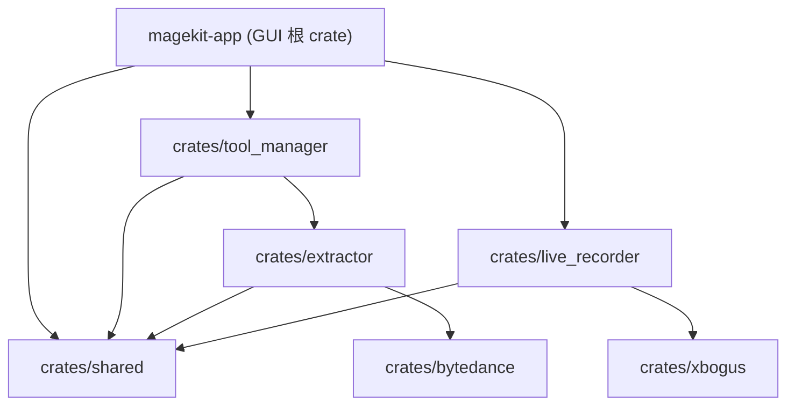

# CLAUDE - MageKit 工作区索引

- 更新时间：2025-12-10T10:19:18Z (UTC)
- 仓库：Rust 2024 工作区，核心依赖 GPUI、yt-dlp、ffmpeg，默认二进制入口 `src/main.rs`（包名 `magekit-app`）。

## 愿景与高层概览

- 面向多平台的视频下载/管理桌面端，提供并发下载、任务队列、工具检测/更新、主题与设置、直播录制扩展。
- 架构分层：GUI（GPUI） ⇄ 共享模型/配置 ⇄ 工具管理器（yt-dlp/ffmpeg 控制）＋扩展库（live recorder、xbogus）。
- 运行时：Tokio + smol；配置与工具目录通过 `shared::utils` 动态解析到平台数据目录。

## 模块索引

| 路径                    | 角色                      | 入口/要点                                           |
| ----------------------- | ------------------------- | --------------------------------------------------- |
| `src/`                  | GPUI 桌面端，路由/状态/UI | `main.rs`，`app/state.rs`，`ui/main_window.rs`      |
| `crates/tool_manager/`  | 工具与下载任务调度        | `src/task_manager.rs`，`downloader.rs`，`config.rs` |
| `crates/shared/`        | 共享类型/配置/工具函数    | `src/types.rs`，`utils.rs`                          |
| `crates/live_recorder/` | 直播录制/探测库           | `src/core.rs`，`types.rs`                           |
| `crates/extractor/`     | 自研解析/yt-dlp 桥接      | `src/lib.rs`，`douyin.rs`                           |
| `crates/bytedance/`     | 抖音/TikTok Web API/签名  | `src/douyin/api.rs`，`sign/*`                       |
| `crates/xbogus/`        | X-Bogus/AB-Sign 签名      | `src/lib.rs`，`x-bogus.js`                          |

## 结构图（已生成 Mermaid）

## 核心流程摘要

- 启动：`main.rs` 配置 tracing、主题热加载、初始化路由，构造 `AppState::new_sync()`（Tokio runtime + `ToolManager` + 配置 + 任务恢复），注入 `GlobalAppState` 后打开主窗口（`MainWindow` 缓存多页面）。
- 下载：GUI 事件调用 `AppState` → `ToolManager`。下载/获取信息均支持 Cookie 文件（按 URL 平台匹配）与 ffmpeg/yt-dlp 路径降级到系统 PATH。进度/取消/暂停通过线程安全标志与 MPSC 通道反馈。
- 任务与队列：`ToolManager` 内部 `TaskQueue` 控制并发，`TaskPersistence` 持久化，支持重试、队列优先级、批量暂停/恢复/取消、速度限制。
- 配置与工具目录：`shared::utils::{get_app_config_dir,get_app_data_dir,get_tools_dir}` 使用 `dirs` 解析平台数据目录；工具配置文件 `tool_manager.toml` 写入配置目录；应用配置 `AppConfig` 默认存在或首次写入。
- 直播录制：`live_recorder` 提供 `LiveRecorderCore` 接口（PlatformFactory 扩展点），可 `start_recording/check_room_status/get_stream_info`，配置 `RecordConfig`（质量、分段、Headers、代理）。
- 签名：`xbogus` 利用 QuickJS 运行 `x-bogus.js`，并提供 Rust AB-Sign 备用实现，暴露 `XBogus::sign` 与便捷 `sign()`。

## 全局规范

- 注释与日志使用中文，日志配表情（🚀/✅/❌/⚠️）；GPUI 异步需 `cx.spawn`/`smol::unblock`，更新状态用 `this.update(...); cx.notify()`。
- 主题：`themes/` 目录由 `ThemeRegistry::watch_dir` 热载；UI 颜色通过 `cx.theme()`。
- 目录与文件安全：文件名通过 `sanitize_filename`，输出路径冲突追加序号。

## 覆盖率与缺口

- 已扫文件：约 32 / 150（~21%）；已覆盖模块：7/7（含 extractor/bytedance 关键路径）。
- 未细读：GUI 子页面与组件（`src/ui/pages/*`）、工具存储/更新与队列（`tool_manager/{storage,updater,task_queue}.rs`）、extractor 的 `tiktok.rs` 与 `ytdlp.rs`、bytedance 签名与 endpoints 细节、直播平台适配与录制实现（`live_recorder/platforms`, `recorder`, `stream`）、`xbogus/x-bogus.js`、测试目录。
- 建议下一步：优先补扫 `tool_manager/storage.rs`、`task_queue.rs`，`crates/extractor/tiktok.rs` 与 `ytdlp.rs`，`crates/bytedance/sign/*`，`src/ui/pages` 交互绑定。
