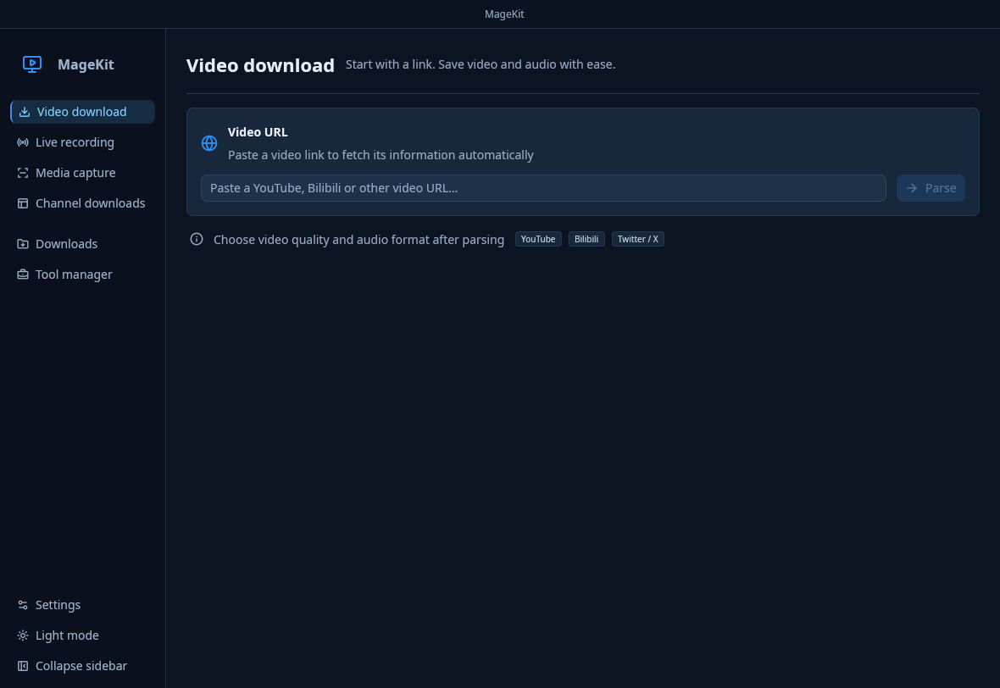
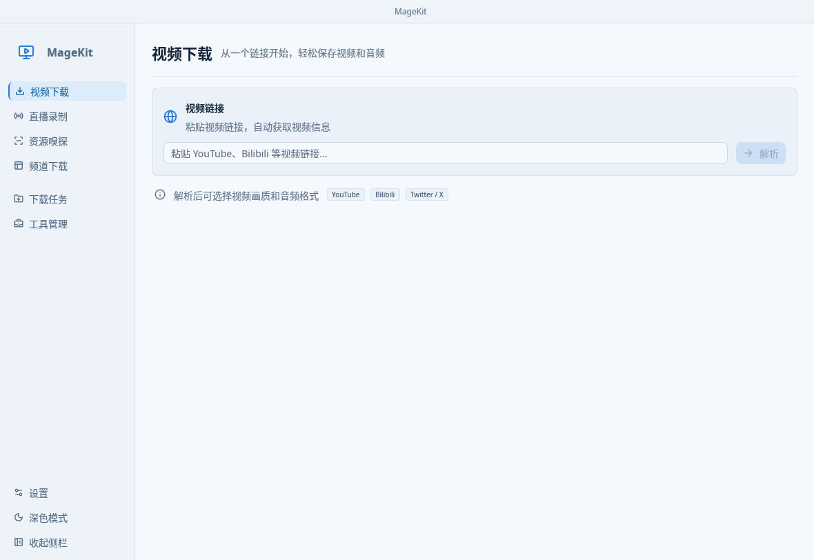

<div align="center">


# MageKit

**Download videos. Capture media. Record live streams.**

A native desktop media toolkit built with Rust, GPUI Fast, and GPUI Kit.

[Download](https://github.com/emojiiii/magekit-app/releases/latest) · [Features](#features) · [Build from source](#build-from-source) · [Documentation](#documentation) · [中文说明](README.zh-CN.md)

</div>



## Overview

MageKit brings video downloads, channel browsing, webpage media capture, and live recording into one desktop workspace. It combines native platform integrations with yt-dlp, FFmpeg, and Streamlink, while keeping tools and download tasks manageable from the app.

The interface supports **English, 简体中文, and system language**, with persistent language selection and light/dark themes. This README describes the current `main` source; packaged releases may lag behind it.

## Features

| Workspace | What you can do |
| --- | --- |
| **Video downloads** | Paste a supported media URL, inspect available formats, choose video/audio options, and queue downloads |
| **Channel downloads** | Browse supported channel pages and add selected videos to the download queue |
| **Media capture** | Discover media resources from webpages through static inspection and a browser-backed capture session |
| **Live recording** | Manage rooms, monitor supported streams, record manually or automatically, and browse rooms in searchable grid/list views |
| **Task management** | Track progress and history, configure concurrency, and pause, resume, retry, or cancel supported tasks |
| **Tool management** | Check, install, and update yt-dlp, FFmpeg, Deno, and the managed Streamlink environment |
| **Preferences** | Set output locations, format and subtitle options, proxies, platform cookies, language, and themes |

### Platform support

- Video downloads use native integrations where available, with yt-dlp handling additional sites such as YouTube, Bilibili, and X. Actual availability depends on the URL, extractor version, account permissions, and the website.
- Live recording uses a native Douyin recorder and Streamlink for supported non-Douyin platforms, including integrations for Bilibili, Douyu, Huya, and SOOP. A room or platform label does not guarantee a working Streamlink plugin. Kuaishou recording is currently unsupported.
- Login cookies only help with content your account is allowed to access. MageKit does not provide a way around DRM, paid access, or other access restrictions.

## Screenshots

Screenshots are real application-window captures on Linux, using the source tree merged into `main` at [`84dff99`](https://github.com/emojiiii/magekit-app/commit/84dff99fd8049e06b7fde524a00aaaaac0ac1d64). They show an isolated demo configuration, not a user's account or live recording session. Other operating systems and older releases may look different.

### Chinese interface · light theme



## Download and install

Get a package from [GitHub Releases](https://github.com/emojiiii/magekit-app/releases). Choose an asset that exists for the release you want:

| Platform | Packages |
| --- | --- |
| **Windows x64** | Standalone `.exe` or portable `.zip` |
| **macOS · Intel / Apple Silicon** | Universal `.dmg` or `.app.zip` |
| **Linux x64** | `.AppImage` or `.tar.gz` |

The published release notes list platform requirements. On Linux, a working graphics driver and the system libraries required by GPUI are needed. For a downloaded AppImage, grant executable permission before opening it. Keep packaged resources together when extracting an archive.

### First run

1. Open **Settings** and choose an output folder, language, and theme.
2. Open **Tools** to check yt-dlp and FFmpeg. Install or update missing tools as needed.
3. Paste a media link into **Video downloads**, parse it, choose the available format options, and start a task.
4. Open **Tasks** to follow progress and manage downloads.

YouTube JavaScript challenges may require Deno; MageKit can install it from the official release source and exposes repair/update controls in Tools. The official standalone yt-dlp distribution includes its EJS scripts.

For non-Douyin live recording, install the **Streamlink** environment from Tools. Its initial setup needs network access to obtain managed Python and Python dependencies. Release builds bundle the uv bootstrap executable, not a complete offline recording environment. See the [recording runtime guide](docs/streamlink.md).

## Build from source

### Requirements

- A current stable Rust toolchain supporting **edition 2024**, plus Git
- **Python 3** for the recorder's build helper and translation checks
- **Windows:** Visual Studio C++ build tools and the Windows SDK
- **macOS:** Xcode Command Line Tools
- **Linux:** a C/C++ toolchain and the native libraries used by GPUI

On Ubuntu/Debian, the current CI installs:

```bash
sudo apt-get update
sudo apt-get install -y build-essential clang cmake ninja-build pkg-config libssl-dev \
  libfontconfig1-dev libfreetype6-dev libxkbcommon-dev libxkbcommon-x11-dev \
  libwayland-dev libxcb1-dev libxcb-render0-dev libxcb-shape0-dev \
  libxcb-xfixes0-dev libx11-dev libx11-xcb-dev libasound2-dev \
  libvulkan-dev libegl1-mesa-dev
```

### Run and build

```bash
git clone https://github.com/emojiiii/magekit-app.git
cd magekit-app
cargo run --locked --bin magekit

# Optimized application binary
cargo build --release --locked --bin magekit
```

The binary is written to `target/release/magekit` (`magekit.exe` on Windows). Run from the repository root during development so the theme resources are available.

Release builds download and verify a target-specific uv executable. Development builds do not bundle it: install uv separately or set `MAGEKIT_UV_PATH` when testing the Streamlink runtime. Offline build overrides and cross-compilation details are documented in [docs/streamlink.md](docs/streamlink.md).

### Checks

```bash
cargo fmt --all -- --check
cargo check --workspace --all-targets --locked
cargo test --locked --bin magekit
python3 scripts/check_i18n.py
```

These commands cover formatting, compilation, application regressions, and translation consistency; they are not the full integration suite. Some workspace tests use live websites or external media tools. The [CI workflow](.github/workflows/ci.yml), [Streamlink workflow](.github/workflows/streamlink.yml), and [verification notes](docs/security-ux-review.md) document separate coverage and known failures. See [Actions](https://github.com/emojiiii/magekit-app/actions) for current results.

## Project layout

```text
src/                    Native application, UI pages, state, and localization
crates/
  shared/               Shared configuration, types, and paths
  tool_manager/         Tool installation, task scheduling, and persistence
  download/             Download engines and progress handling
  extractor/            Media metadata and platform extraction
  platform_api/         Platform API integrations
  capture/              Webpage media discovery
  live_recorder/        Recording and managed Streamlink runtime
  xbogus/               Platform request-signing helpers
locales/                English and Chinese translation sources
themes/                 Theme definitions
scripts/                Translation, build, and release tooling
docs/                   Architecture and usage notes
```

## Documentation

- [Application architecture](docs/gui_app.md)
- [GPUI Fast / GPUI Kit migration](docs/gpui-migration.md)
- [Language selection and translation maintenance](docs/localization.md)
- [Live recording and Streamlink runtime](docs/streamlink.md)
- [Security, UX, and verification notes](docs/security-ux-review.md)
- [Developer guide](agents.md)
- [Release workflow](.github/workflows/release.yml)

The release workflow plans a version after a push to `main`. Documentation-only changes and commits marked `[skip release]` do not independently trigger a release, but cannot suppress earlier unpublished code changes. A documentation-only advance of `main` does not discard a completed build; the release tag always points to the exact source commit used for its packages. Platform builds and artifact checks must succeed before a tag and release are published.

## Troubleshooting and responsible use

- **A download fails:** check the URL and available formats, then the tool versions, proxy settings, and your account's access. Website changes can require an extractor update.
- **Recording fails:** confirm FFmpeg and the recording runtime are installed, the stream is accessible, and the output folder is writable. Include the platform and error stage in a bug report.
- **The app will not start:** check system libraries and graphics-driver support; include your OS and app version in the issue.
- **Reporting a problem:** remove cookies, tokens, signed URLs, and personal paths from logs and screenshots. Configuration can contain sensitive account data; do not commit or share it.

Only download or record content you own or have permission to use, and follow the source platform's terms.

## Contributing and license

[Issues](https://github.com/emojiiii/magekit-app/issues) and focused pull requests are welcome. Include reproduction steps and relevant checks; for UI changes, include a screenshot and the language/theme used.

`Cargo.toml` declares **MIT OR Apache-2.0**. Standalone project license files have not yet been added; see the repository's current licensing materials before redistribution. Bundled tools and dependencies retain their own licenses.

Built with [GPUI Fast](https://github.com/longbridge/gpui-fast), [GPUI Kit](https://github.com/longbridge/gpui-kit), [yt-dlp](https://github.com/yt-dlp/yt-dlp), [FFmpeg](https://ffmpeg.org/), [Streamlink](https://github.com/streamlink/streamlink), [uv](https://github.com/astral-sh/uv), and [Tokio](https://tokio.rs/).
